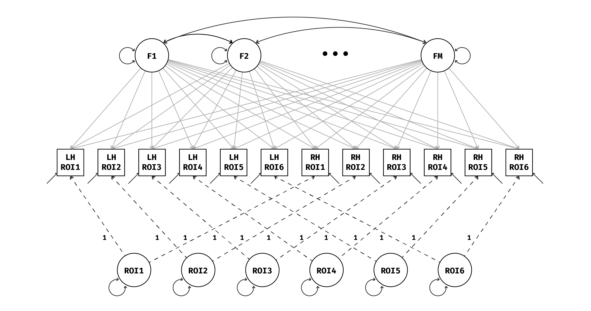

<h3 align="center"> EFAST </h3>
<p align="center">
</img><br/><br/>
<a href="https://travis-ci.org/vankesteren/efast"></img></a>
</p>
<h4 align="center">Exploratory Factor Analysis with Structured Residuals</h4>

<p align="center">
Create and fit exploratory factor analysis with structured residuals (EFAST) models for data with feature covariance due to symmetry structure.
</p>

```r
remotes::install_github("vankesteren/efast")
library(efast)
simdat <- simulate_efast()
fit_sim <- efast_hemi(
  data   = simdat, 
  M      = 4, 
  lh_idx = 1:17, 
  rh_idx = 18:34
)
efast_loadings(fit_sim, symmetry = TRUE)
```
```
Loadings:
         F1     F2     F3     F4    
lh_ROI1   0.574                     
lh_ROI2   0.620                     
lh_ROI3   0.551                     
lh_ROI4   0.563         0.100       
lh_ROI5   0.594                     
lh_ROI6   0.617                     
lh_ROI7   0.547                     
lh_ROI8   0.619        -0.101       
lh_ROI9          0.636              
lh_ROI10         0.732              
lh_ROI11         0.665              
lh_ROI12                0.731       
lh_ROI13                0.594  0.100
lh_ROI14                0.650       
lh_ROI15                       0.723
lh_ROI16                       0.653
lh_ROI17                       0.647
rh_ROI1          0.674              
rh_ROI2          0.684              
rh_ROI3          0.724              
rh_ROI4                 0.770       
rh_ROI5                 0.721       
rh_ROI6                 0.706       
rh_ROI7                        0.689
rh_ROI8                        0.704
rh_ROI9          0.609              
rh_ROI10  0.102  0.731              
rh_ROI11         0.669              
rh_ROI12                0.667       
rh_ROI13                0.641       
rh_ROI14                0.647       
rh_ROI15                       0.734
rh_ROI16                       0.637
rh_ROI17                       0.666

                  F1    F2    F3    F4
SS loadings    2.797 4.214 4.265 3.777
Proportion Var 0.082 0.124 0.125 0.111
Cumulative Var 0.082 0.206 0.332 0.443
```

