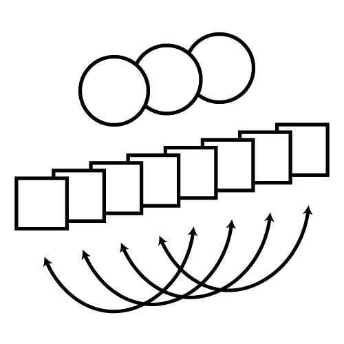

<h3 align="center"> EFAST </h3>
<p align="center"><a href="https://travis-ci.org/vankesteren/efast"></img></a><br/>
</img>
</p>


#### Exploratory Factor Analysis with Structured Residuals
Create and fit exploratory factor analysis with structured residuals (EFAST) models for data with feature covariance due to symmetry structure.
<p align="center">
</img><br/>
</p>

#### Installing efast
Run the following code to install `efast` with the tutorial vignette.
```r
remotes::install_github("vankesteren/efast", build_vignettes = TRUE)
```

#### Quickstart
To quickly fit an EFAST model and see the structure of the data required, you can use simulated data from the package:
```r
library(efast)
simdat <- simulate_efast()
fit_sim <- efast_hemi(
  data   = simdat, 
  M      = 4, 
  lh_idx = 1:17, 
  rh_idx = 18:34
)
efast_loadings(fit_sim, symmetry = TRUE)
lateralization(fit_sim)
```

#### Tutorial
An extended tutorial for using EFAST is included in the vignette.
```r
vignette("efast_braindata")
```

#### Support
Questions can be asked on the [`issues page`](https://github.com/vankesteren/efast/issues). I'll try to answer them as soon as possible!