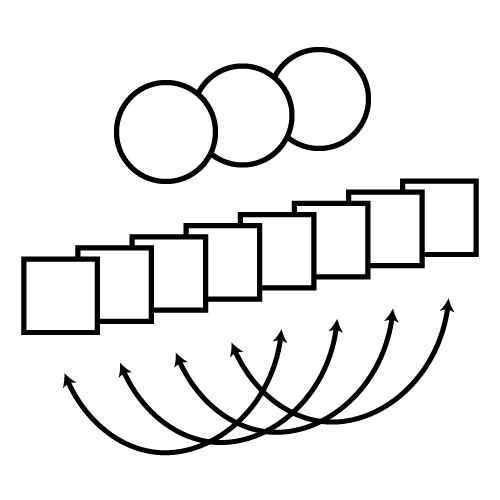

<p align="center">

</p>

# Getting started with EFAST

Download the package from GitHub using the `remotes` or `devtools` package:

```r
remotes::install_github("vankesteren/efast")
```

Follow the tutorials here:

## [EFAST models on structural brain imaging data](./efast_models)
A full tutorial on how to fit an EFAST model to a real dataset with a symmetry residual structure.

## [Background: EFA models using lavaan](./efa_lavaan)
A short introduction to EFA blocks in lavaan, and how it relates to conventional EFA as well as to the EFAST package.

## [Advanced: Extending EFAST models](./extend_efast)
A look into the generated syntax underlying the EFAST models and how to extend it for your purposes.
